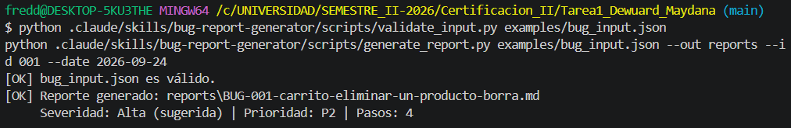
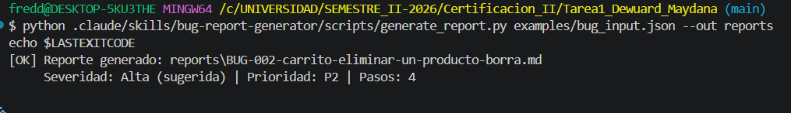
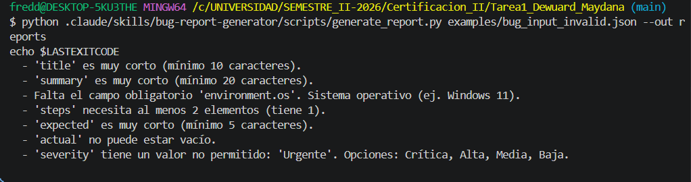
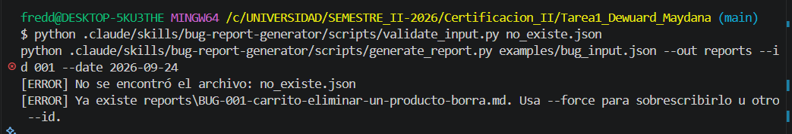
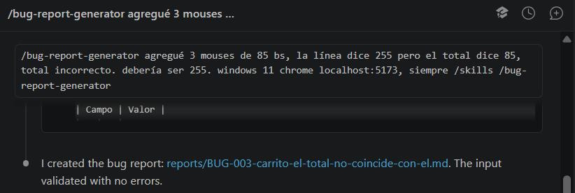

# Bug Report Generator — Skill para Claude Code

**Autor:** Dewuard Maydana · Certificación II — Tarea 1

Skill que convierte la descripción cruda de un defecto (texto informal, pasos sueltos, logs) en un **bug report profesional en Markdown**, validado contra un schema y con **severidad y prioridad sugeridas** automáticamente cuando el usuario no las indica.

## Inicio rápido (5 minutos)

Necesitas **Python 3.8+**, **Node.js 20.19+** y **Claude Code**. Todos los comandos se ejecutan en la carpeta raíz del repositorio.

**1. Descargar el proyecto**
```bash
git clone https://github.com/freddymaydana131-cpu/Tarea1_Dewuard_Maydana.git
cd Tarea1_Dewuard_Maydana
```

**2. Probar la skill sin Claude** (genera un reporte a partir del ejemplo)
```bash
python .claude/skills/bug-report-generator/scripts/generate_report.py examples/bug_input.json
```
Verás `[OK] Reporte generado: reports/BUG-001-...md`. Abre ese archivo: es el bug report terminado.
> En macOS/Linux, si `python` no existe, usa `python3`.

**3. Abrir la página de prueba con bugs**
```bash
npm install
npm run dev
```
Se abre http://localhost:5173 (Mini Tienda). Busca un bug, por ejemplo: agrega 3 veces el Mouse y mira el total.

**4. Reportar el bug con Claude** (en otra terminal, también en la raíz del repo)
```bash
claude
```
Escribe en el chat:
```
/bug-report-generator agregué 3 mouses de 85 bs y el total dice 85, total incorrecto, debería ser 255. windows 11 chrome localhost:5173
```

**5. Ver el resultado** en la carpeta `reports/`: Claude te dice la ruta del archivo, la severidad sugerida y qué datos faltan.

El resto de este documento explica cada parte en detalle.

## ¿Cuándo usarla?

Cuando necesites reportar un bug a desarrollo y tengas solo una descripción informal, por ejemplo:

> "cuando borro un producto del carrito se me borran otros también…"

La skill se activa con frases como *"redacta un bug report"*, *"documenta este defecto"*, *"crea un ticket de bug"*, o directamente con `/bug-report-generator`.

## Flujo completo

```
Texto crudo del usuario
        │  (Claude lee references/ y estructura los datos)
        ▼
reports/tmp_input.json ──► scripts/validate_input.py ──► ¿errores? ─ sí ─► corregir / preguntar al usuario
                                                             │ no
                                                             ▼
                          scripts/generate_report.py
                          ├─ assets/input_schema.json   (vuelve a validar)
                          ├─ assets/severity_rules.json (sugiere severidad/prioridad)
                          └─ assets/report_template.md  (rellena la plantilla)
                                                             ▼
                                        reports/BUG-001-<slug>.md
```

## Estructura

```
.claude/skills/bug-report-generator/
├── SKILL.md                       # Cuándo usarla y flujo que sigue Claude
├── scripts/
│   ├── validate_input.py          # Valida el JSON contra el schema
│   └── generate_report.py         # Valida, clasifica, rellena plantilla y guarda el .md
├── assets/
│   ├── input_schema.json          # Campos, tipos, obligatorios y valores permitidos
│   ├── severity_rules.json        # Palabras clave → severidad; severidad → prioridad
│   └── report_template.md         # Plantilla del reporte
└── references/
    ├── writing_guidelines.md      # Cómo redactar cada campo
    └── severity_guide.md          # Criterios de severidad y prioridad
package.json                       # Scripts npm (dev/build/preview) para la página de prueba
demo-app/                          # Página "Mini Tienda" con 5 bugs para probar la skill
├── index.html · styles.css · app.js
└── BUGS.md                        # Solucionario de los bugs
examples/
├── raw_bug.txt                    # Entrada cruda de ejemplo
├── bug_input.json                 # JSON estructurado de ejemplo
├── bug_input_invalid.json         # JSON con errores para probar la validación
└── expected_output.md             # Resultado esperado
capturas/                          # Evidencia de las pruebas (ver "Pruebas y capturas")
```

## Requisitos

- **Python 3.8+** (probado con 3.14). Sin dependencias externas: solo biblioteca estándar.
- **Node.js 20.19+ y npm** — solo para levantar la página de prueba con `npm run dev` (la skill no lo necesita).
- **Claude Code** para usarla como skill (opcional: los scripts funcionan solos).

## Instalación

1. Clonar el repositorio:
   ```bash
   git clone https://github.com/freddymaydana131-cpu/Tarea1_Dewuard_Maydana.git
   cd Tarea1_Dewuard_Maydana
   ```
2. Verificar Python (en macOS/Linux puede ser `python3`):
   ```bash
   python --version
   ```
3. Instalar Vite, solo necesario para la página de prueba:
   ```bash
   npm install
   ```
4. **Como skill del proyecto:** ya está en `.claude/skills/bug-report-generator/`; Claude Code la detecta al abrir el proyecto.
   **Para usarla en cualquier proyecto:** copiar la carpeta a `~/.claude/skills/`:
   ```bash
   # Linux / macOS / Git Bash
   cp -r .claude/skills/bug-report-generator ~/.claude/skills/
   ```
   ```powershell
   # PowerShell
   Copy-Item -Recurse .claude\skills\bug-report-generator $HOME\.claude\skills\
   ```

## Uso

### Opción A — Con Claude Code

Abre Claude Code **en la carpeta raíz del repositorio** (ahí está `.claude/skills/`, que es donde Claude encuentra la skill):
```bash
cd Tarea1_Dewuard_Maydana
claude
```
Y en el chat:
```
/bug-report-generator en la tienda cuando borro un producto del carrito se me borran otros también, estoy en windows 11 con chrome 128...
```
Claude leerá las guías, armará el JSON, lo validará, generará el reporte en `reports/` y te dirá la ruta, la severidad sugerida y qué campos faltan. Si falta un dato obligatorio (p. ej. el sistema operativo), te lo preguntará.

### Opción B — Scripts manuales

```bash
# 1. Validar
python .claude/skills/bug-report-generator/scripts/validate_input.py examples/bug_input.json

# 2. Generar
python .claude/skills/bug-report-generator/scripts/generate_report.py examples/bug_input.json --out reports
```

Opciones de `generate_report.py`:

| Opción | Descripción | Por defecto |
|---|---|---|
| `--out` | Carpeta de salida | `reports` |
| `--id` | Número del bug (`7` → `BUG-007`) | siguiente disponible en `--out` |
| `--date` | Fecha `AAAA-MM-DD` | hoy |
| `--force` | Sobrescribe si el reporte ya existe | no |

## Formato de entrada

Definido en `assets/input_schema.json`:

| Campo | Obligatorio | Reglas |
|---|---|---|
| `title` | ✅ | texto, 10–120 caracteres |
| `summary` | ✅ | texto, ≥ 20 caracteres |
| `environment.os` | ✅ | texto |
| `environment.browser` / `app_version` / `url` | — | texto |
| `steps` | ✅ | lista de textos, ≥ 2 pasos |
| `expected` / `actual` | ✅ | texto, ≥ 5 caracteres |
| `component`, `reporter` | — | texto |
| `severity` | — | `Crítica`, `Alta`, `Media`, `Baja` (si falta, se sugiere) |
| `priority` | — | `P1`–`P4` (si falta, se deriva de la severidad) |
| `frequency` | — | `Siempre`, `A veces`, `Rara vez`, `Una vez` |
| `evidence` | — | lista de textos |

## Ejemplo

**Entrada cruda** (`examples/raw_bug.txt`):
```
oye en la tienda tech cuando borro un producto del carrito se me borran otros tambien, puse un iphone y un samsung (los dos son smartphones) y le di quitar al iphone y desaparecieron los dos...
```

**JSON estructurado** (`examples/bug_input.json`) → comando:
```bash
python .claude/skills/bug-report-generator/scripts/generate_report.py examples/bug_input.json --out reports --id 001 --date 2026-09-24
```

**Salida en consola:**
```
[OK] Reporte generado: reports\BUG-001-carrito-eliminar-un-producto-borra.md
     Severidad: Alta (sugerida) | Prioridad: P2 | Pasos: 4
```

**Resultado:** `reports/BUG-001-carrito-eliminar-un-producto-borra.md`, idéntico a `examples/expected_output.md`. La severidad sale *Alta (sugerida)* porque el texto contiene "se eliminan", una palabra clave de la regla `Alta` en `assets/severity_rules.json`.

## Página de prueba (`demo-app/`)

Para tener bugs reales que reportar, el repo incluye **Mini Tienda**: una página HTML/CSS/JS con un catálogo de artículos, buscador, carrito y cupón, que tiene **5 errores intencionales** (uno por cada severidad). Se sirve con Vite.

```powershell
npm install      # solo la primera vez
npm run dev      # abre http://localhost:5173 en el navegador
```

| Script | Qué hace |
|---|---|
| `npm run dev` | Servidor de desarrollo en http://localhost:5173 |
| `npm run build` | Genera la versión de producción en `dist/` |
| `npm run preview` | Sirve `dist/` en http://localhost:4173 |

Sin Node.js también funciona: `python -m http.server 5173 -d demo-app` o doble clic en `demo-app/index.html`.

Flujo de demostración:
1. Encontrar un bug en la página (por ejemplo, agregar 3 veces el mismo artículo y mirar el total).
2. Describirlo con tus palabras: `/bug-report-generator agregué 3 mouses de 85 bs y el total dice 85...`
3. Revisar el reporte generado en `reports/`.

El solucionario con los 5 bugs, cómo reproducirlos y la severidad que sugiere la skill está en [`demo-app/BUGS.md`](demo-app/BUGS.md).

## Códigos de salida y errores

| Código | Significado | Ejemplo de mensaje |
|---|---|---|
| `0` | Éxito | `[OK] bug_input.json es válido.` |
| `1` | Contenido inválido | `'steps' necesita al menos 2 elementos (tiene 1).` |
| `2` | Archivo/argumento inválido | `No se encontró el archivo: x.json` · `JSON mal formado en x.json (línea 2, columna 1)` · `--date debe tener formato AAAA-MM-DD` |
| `3` | El reporte ya existe | `Ya existe reports\BUG-001-....md. Usa --force para sobrescribirlo u otro --id.` |

Ver el código de salida: `echo $?` (Bash) o `echo $LASTEXITCODE` (PowerShell).

## Pruebas y capturas

Comandos ejecutados desde la raíz del repo (Git Bash). Para ver el código de salida: `echo $?` en Git Bash o `echo $LASTEXITCODE` en PowerShell.

### 1. Caso exitoso: validar y generar (exit 0)
```bash
python .claude/skills/bug-report-generator/scripts/validate_input.py examples/bug_input.json
python .claude/skills/bug-report-generator/scripts/generate_report.py examples/bug_input.json --out reports --id 001 --date 2026-09-24
```
Resultado: `[OK] bug_input.json es válido.` y `[OK] Reporte generado: reports\BUG-001-...md` con severidad **Alta (sugerida)**, prioridad **P2**.



### 2. Caso exitoso: ID automático (exit 0)
Sin `--id`, el script toma el siguiente número libre en `reports/` (BUG-002).
```bash
python .claude/skills/bug-report-generator/scripts/generate_report.py examples/bug_input.json --out reports
```


### 3. Entrada inválida (exit 1)
`examples/bug_input_invalid.json` tiene título y resumen muy cortos, falta `environment.os`, un solo paso, `actual` vacío y una severidad no permitida (`Urgente`). El script **no genera el reporte** y lista los 7 problemas.
```bash
python .claude/skills/bug-report-generator/scripts/generate_report.py examples/bug_input_invalid.json --out reports
```


### 4. Problemas habituales: archivo inexistente (exit 2) y reporte duplicado (exit 3)
```bash
python .claude/skills/bug-report-generator/scripts/validate_input.py no_existe.json
python .claude/skills/bug-report-generator/scripts/generate_report.py examples/bug_input.json --out reports --id 001 --date 2026-09-24
```
Resultado: `[ERROR] No se encontró el archivo: no_existe.json` y `[ERROR] Ya existe reports\BUG-001-...md. Usa --force para sobrescribirlo u otro --id.`



### 5. Flujo completo con Claude Code
Bug real encontrado en la Mini Tienda (`npm run dev`), descrito de forma informal:
```
/bug-report-generator agregué 3 mouses de 85 bs, la línea dice 255 pero el total dice 85, total incorrecto. debería ser 255. windows 11 chrome localhost:5173, siempre
```
Claude estructuró el JSON, lo validó sin errores y generó `reports/BUG-003-carrito-el-total-no-coincide-con-el.md` con severidad **Alta (sugerida)** por la palabra clave "total incorrecto".



## Decisiones de diseño

- **Python sin dependencias:** se ejecuta igual en Windows, Linux y macOS sin `pip install`.
- **Validación separada de la generación:** Claude puede validar y corregir en ciclo antes de generar; `generate_report.py` vuelve a validar para que nunca salga un reporte incompleto.
- **Reglas y plantilla como assets (datos, no código):** cambiar palabras clave, severidades o el formato del reporte no requiere tocar Python.
- **Severidad marcada como "(sugerida)":** la heurística por palabras clave ayuda, pero la decisión final es humana.
- **No inventar datos:** el `SKILL.md` obliga a Claude a preguntar lo que falte en vez de rellenar con suposiciones.
- **Tolerancia a Windows:** lee JSON con BOM (PowerShell) y fuerza salida UTF-8 para las tildes.
